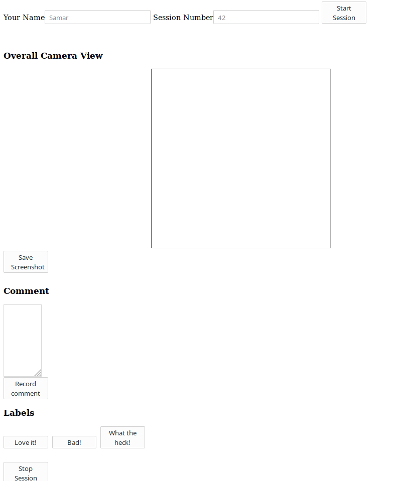

Step 1: Setup database
====
```

$ mysql 
mysql> drop database if exists traildb;
mysql> create database traildb;
mysql> source traildb.sql;

```

Step 2: Change username and password
====

Edit ***db_credentials.py.sample*** and change the database name, username, password and server (to localhost) so that your database can be used. Then save the file as ***db_credentials.py***


Step 3: Create and setup virtual environment
====

```
virtualenv venv
. ./venv/bin/activate
pip install -r requirements.txt
```


Running the application
===

Make sure:
* MySQL/MariaDB is running
* You have done all the 3 steps above.

Now, run
```
./activate.sh 
```

This will activate the virtual environment as well as run the application.
Now you can go to the browser to use the application!

The default URL is as https://localhost:5000

**NOTE** Your browser will probably show a warning about the https certificate.
You can safely ignore it as all your data will be local.

This is what it looks like:




Exporting data to CSV
===

Run the following SQL command on the mysql command line prompt, 
to export all the data to a CSV file named `trail_action_log.csv`. 

This file will be saved to either the directory where you are running the
command from or other location. Having systemd can affect the location as described on 
https://stackoverflow.com/a/11484527

```
USE traildb;

SELECT trail_action_log.trail_id, trail_action_log.time_in_trail, trail_action_log.action, trail.recorder_name 
FROM trail_action_log
JOIN trail on trail.trail_id = trail_action_log.trail_id
INTO OUTFILE 'trail_action_log.csv'
FIELDS TERMINATED BY "," 
ENCLOSED BY "\"" 
LINES TERMINATED BY "\n" 
```

